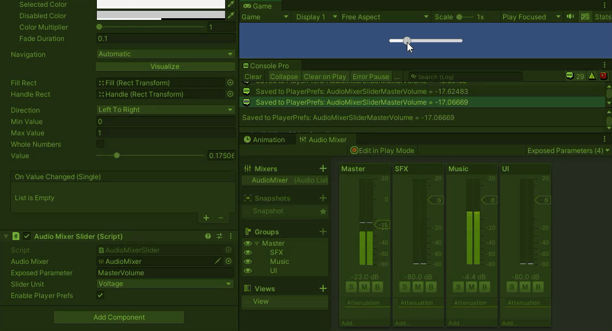

# AudioMixerSlider

Component to update AudioMixer exposed parameter value with Slider, optional to convert between dB and Voltage ratio, and optional to save &amp; load with PlayerPrefs.

#Usage
1. Add Exposed Parameter (https://youtu.be/9tqi1aXlcpE?t=40)
2. Add AudioMixerSlider component to your existed Slider
3. Drop AudioMixer to AudioMixerSlider
4. Fill in Exposed Parameter name (step 2) to AudioMixerSlider
